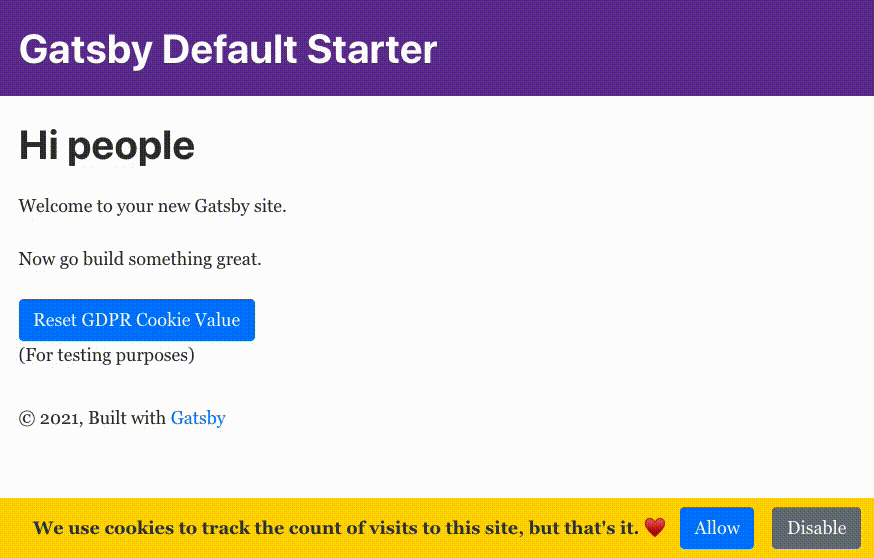

# gatsby-animated-gdpr-banner

A minimalistic GDPR banner for Gatsby sites using Bootstrap styles.

[Check out the GitHub Pages site running this repository!](https://princefishthrower.github.io/gatsby-animated-gdpr-banner/)

Package changes compared to Gatsby starter:

- added `sass`, `gatsby-plugin-sass`, and `bootstrap` packages to add bootstrap styles
- added `gatsby-plugin-gdpr-cookies` for GDPR compliant Google Analytics toggling
- added `react-cookie` for React cookie hooks
- added `react-reveal` for animations
- added `gh-pages` to publish this to GitHub Pages
- removed extraneous pages and converted everything to typescript